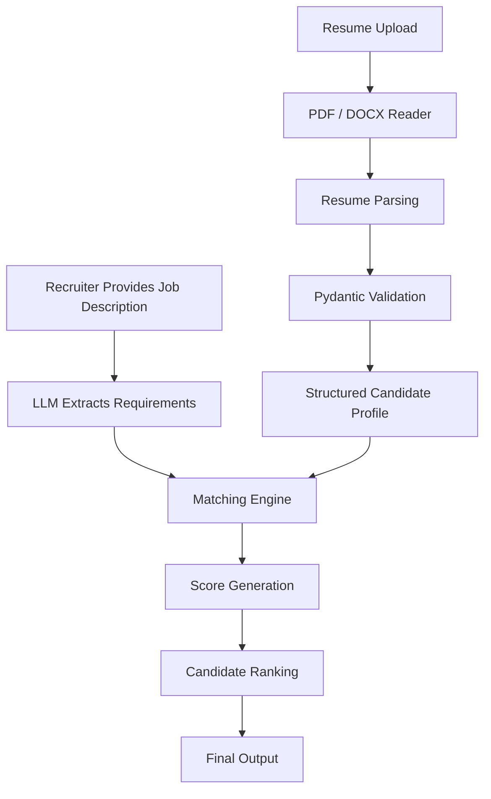
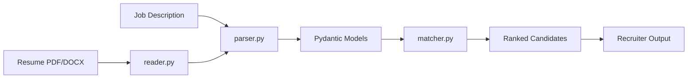
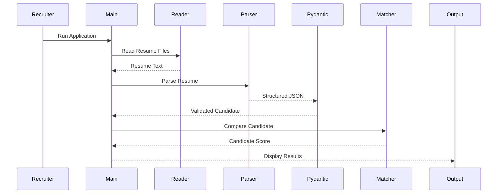
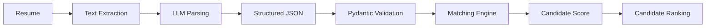
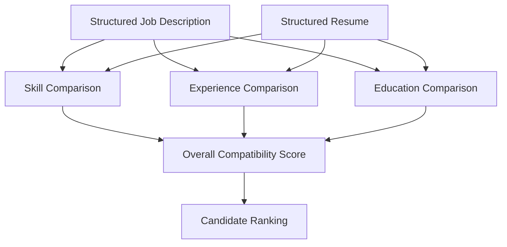

<div align="center">

# 🤖 HireLens AI

### *🚀 Automating AI-driven resume screening with structured LLM outputs and intelligent candidate ranking.*

<p align="center">


</p>

<p align="center">


</p>

---

### 🚀 Intelligent Resume Screening Powered by LLMs

**HireLens AI** automates the resume screening process by extracting structured candidate information from **PDF** and **DOCX** resumes, comparing it against a recruiter-provided job description, and generating an explainable candidate ranking using **Large Language Models**, **Groq API**, and **Pydantic**.

---

### 📌 Quick Links

<a href="#-project-overview">Project Overview</a> •
<a href="#-features">Features</a> •
<a href="#-workflow">Workflow</a> •
<a href="#-project-architecture">Architecture</a> •
<a href="#-installation">Installation</a> •
<a href="#-usage">Usage</a> •
<a href="#-future-roadmap">Roadmap</a>

</div>

---

# 📸 Project Banner

> **Replace this section with your custom banner image once created.**

<p align="center">


</p>

---

# ⚡ Quick Facts

| Property | Value |
|-----------|-------|
| **Project Name** | HireLens AI |
| **Project Type** | AI Resume Screening System |
| **Domain** | Artificial Intelligence / HR Tech |
| **Programming Language** | Python |
| **LLM Provider** | Groq API |
| **Structured Output** | Pydantic |
| **Supported Resume Formats** | PDF, DOCX |
| **Output** | Candidate Ranking & Match Score |
| **Architecture** | Modular Python |
| **Status** | Active Development |

---

## 🚀 Project Highlights

- 📄 PDF & DOCX Resume Support
- 🤖 LLM-Powered Semantic Parsing
- 🧠 Structured Output Validation with Pydantic
- 🎯 Intelligent Candidate Matching
- 📊 Recruiter-Friendly Ranking
- 🏗 Modular Python Architecture

---  

# 📚 Table of Contents

- [📖 Project Overview](#-project-overview)
- [🎯 Why HireLens AI?](#-why-hirelens-ai)
- [✨ Features](#-features)
- [🔄 Workflow](#-workflow)
- [🏗 Project Architecture](#-project-architecture)
- [📂 Folder Structure](#-folder-structure)
- [🛠 Technologies Used](#-technologies-used)
- [⚙ Installation](#-installation)
- [🔐 Environment Variables](#-environment-variables)
- [🚀 Usage](#-usage)
- [📊 Sample Output](#-sample-output)
- [🧠 Prompt Engineering](#-prompt-engineering)
- [🎯 Matching Process](#-matching-process)
- [📈 Candidate Ranking](#-candidate-ranking)
- [🖼 Screenshots](#-screenshots)
- [🛣 Future Roadmap](#-future-roadmap)
- [⚠ Known Limitations](#-known-limitations)
- [🤝 Contributing](#-contributing)
- [📜 License](#-license)
- [👨‍💻 Author](#-author)

---

# 📖 Project Overview

Recruiters often spend significant time manually reviewing resumes to identify candidates who match a specific job role. This process becomes increasingly difficult when hiring for specialized positions or handling large numbers of applications.

**HireLens AI** automates this workflow using **Large Language Models (LLMs)** to understand both job descriptions and resumes semantically rather than relying solely on keyword matching.

The system:

- Extracts structured information from job descriptions
- Parses resumes from PDF and DOCX files
- Converts unstructured text into validated JSON using Pydantic
- Compares candidate profiles against job requirements
- Generates explainable candidate scores
- Produces recruiter-friendly rankings

The project demonstrates practical applications of:

- Large Language Models (LLMs)
- Prompt Engineering
- Structured Output Validation
- Semantic Matching
- Modular Python Development
- AI-powered Decision Support Systems

---

# 🎯 Why HireLens AI?

Traditional Applicant Tracking Systems (ATS) often rely on exact keyword matching, which may overlook qualified candidates whose resumes use different wording.

HireLens AI uses LLM-powered semantic understanding to:

✅ Understand skills and experience contextually

✅ Extract structured information from resumes

✅ Compare candidates against recruiter requirements

✅ Generate explainable rankings

✅ Reduce manual screening effort

✅ Support faster hiring decisions

---

# ✨ Features

## 📄 Resume Processing

- Supports **PDF** resumes
- Supports **DOCX** resumes
- Automatic text extraction
- Unified resume reading pipeline

---

## 🤖 LLM-Based Parsing

- Job Description Parsing
- Resume Parsing
- Structured JSON Generation
- Semantic Understanding
- Context-aware Information Extraction

---

## 🧠 Structured Validation

- Pydantic Models
- Type Validation
- Schema Enforcement
- Reliable Output Formatting

---

## 🎯 Candidate Matching

- Skill Matching
- Experience Comparison
- Education Matching
- Semantic Evaluation
- Candidate Scoring

---

## 📊 Ranking System

- Candidate Ranking
- Match Percentage
- Explainable Results
- Recruiter-friendly Summary

---

# 🔄 Workflow



---

# ⚙ Workflow Explanation

## Step 1 — Job Description Input

The recruiter provides a job description containing:

- Required Skills
- Experience
- Education
- Responsibilities
- Preferred Qualifications

---

## Step 2 — Requirement Extraction

The LLM converts the job description into structured information.

Example:

```json
{
  "skills": [
    "Python",
    "Machine Learning",
    "SQL"
  ],
  "experience": "2 years",
  "education": "Bachelor's Degree"
}
```

---

## Step 3 — Resume Reading

The system reads:

- PDF resumes
- DOCX resumes

using dedicated readers.

---

## Step 4 — Resume Parsing

The LLM extracts:

- Name
- Skills
- Experience
- Education
- Projects
- Certifications

and converts them into structured data.

---

## Step 5 — Validation

Pydantic validates:

- Data Types
- Missing Fields
- JSON Structure

ensuring consistent output.

---

## Step 6 — Matching

The matching engine compares:

| Candidate Information | Job Requirement |
|----------------------|-----------------|
| Skills | Required Skills |
| Experience | Minimum Experience |
| Education | Required Education |
| Projects | Relevant Work |
| Certifications | Preferred Certifications |

---

## Step 7 — Scoring

Each candidate receives:

- Match Percentage
- Candidate Summary
- Recruiter Verdict

---

## Step 8 — Ranking

Candidates are ranked from:

🥇 Best Match

↓

🥈 Strong Match

↓

🥉 Moderate Match

↓

❌ Weak Match

---

# 📌 Key Highlights

✅ LLM-Powered Resume Parsing

✅ Structured JSON Output

✅ Pydantic Validation

✅ Semantic Matching

✅ Explainable Rankings

✅ Modular Python Architecture

✅ Practical AI Application


# 🏗 Project Architecture

HireLens AI follows a **modular architecture** where each component is responsible for a single task. This separation of concerns makes the project easier to understand, maintain, and extend.



---

## 🧩 Architecture Overview

| Module | Responsibility |
|----------|----------------|
| **main.py** | Entry point of the application. Coordinates the complete screening workflow. |
| **reader.py** | Reads PDF and DOCX resumes and extracts raw text. |
| **parser.py** | Uses the LLM to convert raw resume and job description text into structured information. |
| **models.py** | Defines Pydantic models used to validate structured LLM responses. |
| **matcher.py** | Compares candidate information with job requirements and calculates compatibility scores. |
| **requirements.txt** | Lists project dependencies. |
| **README.md** | Project documentation. |

---

# 📂 Project Structure

```text
HireLens-AI/
│
├── README.md
├── LICENSE
├── requirements.txt
├── .env.example
├── .gitignore
│
├── main.py
├── reader.py
├── parser.py
├── matcher.py
├── models.py
│
├── job_description.txt
├── sample_output.txt
│
├── RESUMES/
│   ├── sample_resume_1.pdf
│   ├── sample_resume_2.pdf
│   └── sample_resume_3.docx
│
├── assets/
│   ├── banner.png
│   ├── screenshots/
│   ├── architecture.png
│   └── workflow.png
│
└── docs/
    ├── architecture.md
    └── workflow.md
```

---

## 📁 Folder Description

| Folder/File | Description |
|--------------|-------------|
| **main.py** | Starts the application and controls the workflow. |
| **reader.py** | Handles reading PDF and DOCX resumes. |
| **parser.py** | Extracts structured candidate and job information using an LLM. |
| **matcher.py** | Performs candidate-job matching and scoring. |
| **models.py** | Stores Pydantic schemas for structured validation. |
| **job_description.txt** | Sample recruiter job description. |
| **RESUMES/** | Sample resumes for testing the system. |
| **assets/** | Banner, screenshots, diagrams, and repository images. |
| **docs/** | Additional technical documentation and diagrams. |

---

# 🛠 Technology Stack

| Technology | Purpose |
|------------|---------|
| **Python 3.12** | Core programming language |
| **Groq API** | High-speed LLM inference |
| **GPT-OSS Model** | Resume and job description understanding |
| **Pydantic** | Structured output validation |
| **PyPDF** | Reading PDF resumes |
| **python-docx** | Reading DOCX resumes |
| **python-dotenv** | Loading environment variables |
| **JSON** | Structured data exchange |
| **Pathlib** | Cross-platform file handling |

---

# ⚙ Installation

## 1️⃣ Clone the Repository

```bash
git clone https://github.com/LUCiiFER-07/HireLens-AI.git

cd HireLens-AI
```

---

## 2️⃣ Create a Virtual Environment

### Windows

```bash
python -m venv venv

venv\Scripts\activate
```

### Linux / macOS

```bash
python3 -m venv venv

source venv/bin/activate
```

---

## 3️⃣ Install Dependencies

```bash
pip install -r requirements.txt
```

---

## 4️⃣ Configure Environment Variables

Create a file named

```text
.env
```

Add your Groq API key

```env
GROQ_API_KEY=your_groq_api_key_here
```

---

## 5️⃣ Run the Project

```bash
python main.py
```

---

# 🔐 Environment Variables

HireLens AI uses environment variables to securely store API credentials.

| Variable | Description |
|-----------|-------------|
| **GROQ_API_KEY** | API key used for accessing Groq LLM services |

Example:

```env
GROQ_API_KEY=gsk_xxxxxxxxxxxxxxxxxxxxxxxxxxxxxxxxx
```

> **⚠️ Security Notice**
>
> Never commit your real `.env` file to GitHub.
>
> Instead, include only a `.env.example` file in the repository.

---

# 📦 Dependencies

Install all required packages using:

```bash
pip install -r requirements.txt
```

Core dependencies include:

- Groq
- Pydantic
- PyPDF
- python-docx
- python-dotenv

---

# 📌 Configuration

The application can be customized by modifying:

- Groq Model Name
- Temperature
- Maximum Tokens
- Resume Directory
- Job Description File

These settings are currently defined within the project source and can be centralized into a dedicated configuration module in future versions.

# 🚀 Usage

Once the project is configured, simply execute the application from the project root.

```bash
python main.py
```

The application will:

1. Load the Job Description.
2. Read all resumes from the `RESUMES/` directory.
3. Parse the Job Description using the LLM.
4. Parse each resume into structured data.
5. Validate the extracted data using Pydantic.
6. Compare every candidate with the job requirements.
7. Calculate candidate scores.
8. Rank all candidates.
9. Display recruiter-friendly results.

---

# 🔄 Execution Pipeline



---

# ⚙ Code Workflow

The application follows a modular pipeline where every module performs one specific responsibility.

```text
main.py

↓

reader.py

↓

parser.py

↓

models.py

↓

matcher.py

↓

Final Ranking
```

---

# 📖 Module Documentation

## 🟦 main.py

### Purpose

Acts as the main controller of the application.

It coordinates every module and manages the complete resume-screening workflow.

### Responsibilities

- Loads the Job Description
- Reads all resumes
- Calls the parser
- Validates responses
- Invokes the matching engine
- Displays ranked candidates

---

## 🟩 reader.py

### Purpose

Responsible for extracting text from different resume formats.

### Supported Formats

- PDF
- DOCX

### Responsibilities

- Detect resume type
- Read document contents
- Return clean text for parsing

### Output

Raw resume text.

---

## 🟨 parser.py

### Purpose

Converts unstructured resume text into structured candidate information using a Large Language Model.

### Responsibilities

- Parse Job Description
- Parse Resume
- Generate Structured JSON
- Handle prompt creation
- Process LLM responses

### Output

Validated candidate profile.

---

## 🟥 matcher.py

### Purpose

Compares candidate information against recruiter requirements.

### Responsibilities

- Compare Skills
- Compare Experience
- Compare Education
- Calculate Match Score
- Generate Candidate Summary

### Output

Ranked candidate with compatibility score.

---

## 🟪 models.py

### Purpose

Defines all Pydantic models used for structured validation.

### Responsibilities

- Validate LLM output
- Enforce JSON schema
- Ensure data consistency
- Prevent malformed responses

---

# 📊 Data Flow



# 📚 Core Functions

## Resume Reading

| Function | Description |
|----------|-------------|
| `read_pdf()` | Reads PDF resumes and extracts text |
| `read_docx()` | Reads DOCX resumes and extracts text |
| `read_resume()` | Automatically selects the appropriate reader |

---

## Parsing

| Function | Description |
|----------|-------------|
| `parse_job_description()` | Extracts recruiter requirements |
| `parse_resume()` | Converts resume into structured candidate information |

---

## Matching

| Function | Description |
|----------|-------------|
| `match_candidate()` | Calculates compatibility score |
| `rank_candidates()` | Sorts candidates based on scores |

---

# 🧩 Data Models

The project uses **Pydantic** models to ensure every LLM response follows a predefined schema.

Benefits include:

- Type Safety
- JSON Validation
- Automatic Error Detection
- Consistent Output
- Reliable Parsing

---

# 🤖 LLM Integration

HireLens AI leverages the **Groq API** to perform semantic understanding of resumes and job descriptions.

The LLM is responsible for:

- Extracting skills
- Understanding work experience
- Identifying education
- Parsing projects
- Detecting certifications
- Producing structured JSON

The application validates every response before using it for candidate matching.

---

# 🔒 Error Handling

The system includes safeguards for common issues such as:

- Unsupported file formats
- Empty resumes
- Missing fields
- Invalid JSON responses
- Validation failures
- API communication errors

These checks improve reliability and prevent malformed data from affecting candidate rankings.

---

# 📈 Performance Considerations

Current implementation is designed for small to medium batches of resumes.

Performance depends primarily on:

- Number of resumes
- Resume length
- LLM response time
- Network latency

Because resume parsing relies on an external LLM, overall execution time scales with the number of candidates being processed.

---

# 💡 Design Principles

HireLens AI is built around several software engineering principles:

- Modular Architecture
- Separation of Concerns
- Reusable Components
- Structured Data Validation
- Explainable AI Outputs
- Maintainable Code Organization

# 🧠 Prompt Engineering

HireLens AI leverages **Large Language Models (LLMs)** through the **Groq API** to transform unstructured resumes and job descriptions into structured, machine-readable information.

Instead of relying on keyword matching, the system uses prompt engineering techniques to enable semantic understanding of candidate profiles.

---

## 🎯 Prompt Design Strategy

The prompting workflow follows four major stages:

```text
Raw Text

↓

Instruction Prompt

↓

Schema Definition

↓

LLM Response

↓

Pydantic Validation

↓

Structured Candidate Profile
```

The prompts are carefully designed to encourage:

- Structured JSON responses
- Consistent formatting
- High extraction accuracy
- Minimal hallucinations
- Reliable downstream validation

---

## 📄 Job Description Prompt

The Job Description prompt instructs the LLM to identify and organize recruiter requirements into structured fields.

### Information Extracted

- Required Skills
- Experience Requirements
- Educational Qualifications
- Preferred Skills
- Responsibilities
- Additional Notes

Example Output

```json
{
  "skills": [
    "Python",
    "Machine Learning",
    "SQL"
  ],
  "experience": "2+ years",
  "education": "Bachelor's Degree"
}
```

---

## 👤 Resume Parsing Prompt

The Resume Parsing prompt extracts candidate information from PDF or DOCX resumes.

### Information Extracted

- Candidate Name
- Technical Skills
- Soft Skills
- Work Experience
- Education
- Projects
- Certifications
- Tools & Technologies

Example Output

```json
{
  "name": "John Doe",
  "skills": [
    "Python",
    "FastAPI",
    "TensorFlow"
  ],
  "experience": 3,
  "education": "B.Tech Computer Science"
}
```

---

## ✅ Structured Output Validation

LLM responses are validated using **Pydantic** before being processed further.

Validation ensures:

- Correct JSON format
- Required fields are present
- Proper data types
- Consistent schema
- Reduced parsing errors

This validation layer prevents malformed AI responses from affecting candidate ranking.

---

# 🎯 Matching Process

After both the job description and candidate resumes have been converted into structured data, the matching engine evaluates how closely each candidate aligns with the job requirements.

---

## Matching Pipeline



---

## Evaluation Criteria

The system compares multiple dimensions of a candidate profile.

| Category | Purpose |
|-----------|----------|
| Skills | Compare required and possessed technical skills |
| Experience | Evaluate years and relevance of experience |
| Education | Verify educational qualifications |
| Projects | Identify practical implementation experience |
| Certifications | Consider additional qualifications |

---

# 📊 Candidate Ranking

Every processed candidate receives a compatibility score based on how well their profile matches the job requirements.

The ranking system enables recruiters to quickly identify the most suitable applicants.

---

## Ranking Workflow

```text
Candidate Profile

↓

Requirement Matching

↓

Compatibility Score

↓

Ranking

↓

Recruiter Summary
```

---

## Candidate Categories

| Match Score | Interpretation |
|--------------|----------------|
| 90–100% | Excellent Match |
| 75–89% | Strong Match |
| 60–74% | Moderate Match |
| Below 60% | Weak Match |

> **Note:** These score ranges are illustrative for documentation. The actual scoring depends on the implementation in `matcher.py`.

---

# 📋 Example Output

The following example demonstrates the type of recruiter-friendly summary generated by the system.

```text
=================================================

Candidate: John Doe

Match Score: 92%

Skills:
✔ Python
✔ Machine Learning
✔ SQL

Experience:
✔ 3 Years

Education:
✔ Bachelor of Technology

Projects:
✔ Resume Screening System

Overall Verdict:

Excellent Match

=================================================
```

---

# 💡 Explainable AI

One of the primary goals of HireLens AI is to provide **transparent** and **interpretable** hiring recommendations.

Instead of producing only a numerical score, the system presents supporting information such as:

- Extracted Skills
- Experience Summary
- Educational Background
- Relevant Projects
- Match Percentage
- Overall Recommendation

This enables recruiters to understand **why** a candidate received a particular ranking rather than relying on a black-box decision.

---

# 🎯 Design Philosophy

HireLens AI is designed around three core principles:

### 1️⃣ Reliability

Every AI-generated response is validated before use.

---

### 2️⃣ Explainability

Candidate rankings are supported with structured information instead of opaque scores.

---

### 3️⃣ Modularity

Each stage of the workflow is isolated into independent modules, making the system easier to maintain, test, and extend.

---

# 🚀 Real-World Applications

HireLens AI can be adapted for several recruitment and talent management scenarios.

Examples include:

- AI-powered Applicant Tracking Systems (ATS)
- Enterprise HR Automation
- Campus Recruitment
- Resume Shortlisting
- Talent Acquisition Platforms
- Internal Candidate Evaluation
- Recruitment Process Automation

The modular architecture also makes it suitable for integration into larger HR technology ecosystems.

# 🖼️ Screenshots

Visual demonstrations make it easier to understand the project workflow and output.

> **Note:** Replace the placeholder images below with actual screenshots from your project.

---

## 🏠 Application Overview

<p align="center">
  
</p>

---

## 📄 Resume Parsing

<p align="center">
  
</p>

---

## 📊 Candidate Ranking

<p align="center">
  
</p>

---

## ✅ Final Output

<p align="center">
  
</p>

---

# 🛣️ Future Roadmap

The following features are planned for future releases.

## Core Improvements

- [x] Resume Parsing
- [x] Job Description Parsing
- [x] Candidate Ranking
- [x] Pydantic Validation
- [x] Modular Architecture

---

## Planned Features

- [ ] Streamlit Web Interface
- [ ] FastAPI REST API
- [ ] Batch Resume Processing
- [ ] OCR Support for Scanned Resumes
- [ ] Semantic Vector Search
- [ ] ATS Integration
- [ ] PostgreSQL Database
- [ ] Docker Support
- [ ] Authentication
- [ ] Unit Testing
- [ ] GitHub Actions CI/CD
- [ ] Performance Logging
- [ ] Multi-language Resume Support
- [ ] Recruiter Dashboard
- [ ] Resume Analytics

---

# ⚠️ Known Limitations

Current limitations of the project include:

- Processing speed depends on LLM response time.
- Internet connection is required to access the Groq API.
- Only PDF and DOCX resume formats are supported.
- Resume quality affects extraction accuracy.
- Candidate ranking quality depends on the quality of the provided job description.
- The system is designed for demonstration and educational purposes; production deployments may require additional validation and monitoring.

---

# 🤝 Contributing

Contributions are welcome and appreciated.

If you would like to improve this project:

1. Fork the repository.
2. Create a new feature branch.

```bash
git checkout -b feature/your-feature-name
```

3. Commit your changes.

```bash
git commit -m "Add your feature"
```

4. Push the branch.

```bash
git push origin feature/your-feature-name
```

5. Open a Pull Request.

Please ensure that your contribution:

- Follows the existing coding style.
- Includes appropriate documentation.
- Maintains modular design.
- Does not introduce breaking changes without explanation.

---

# 📜 License

This project is licensed under the **MIT License**.

See the `LICENSE` file for more information.

---

# 👨‍💻 Author

## Pranjal Bhardwaj

**B.Tech – Instrumentation Engineering**

Sant Longowal Institute of Engineering and Technology (SLIET)

### Connect with Me

- **GitHub:** https://github.com/LUCiiFER-07
- **LinkedIn:** *(Add your LinkedIn Profile URL)*
- **Email:** *(Add your Professional Email)*

---

# 🙏 Acknowledgements

Special thanks to the open-source community and the developers of the technologies that made this project possible.

- Python
- Groq
- Pydantic
- PyPDF
- python-docx
- python-dotenv

---

# ⭐ Support the Project

If you found this project useful:

⭐ Star this repository

🍴 Fork the repository

🐛 Report issues

💡 Suggest improvements

Every contribution helps make HireLens AI better.

---

<div align="center">

## 🚀 HireLens AI

### Intelligent Resume Screening Powered by Large Language Models

**Built with ❤️ using Python, Groq API, and Pydantic**

⭐ **If you like this project, don't forget to star the repository!**

</div>
