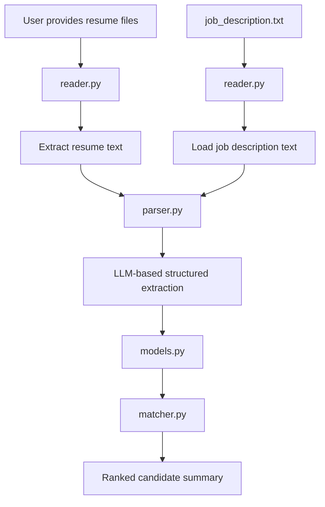

# Architecture Diagram

```mermaid
flowchart TD
    A[User provides resume files] --> B[reader.py]
    B --> C[Extract resume text]
    D[job_description.txt] --> E[reader.py]
    E --> F[Load job description text]
    C --> G[parser.py]
    F --> G
    G --> H[LLM-based structured extraction]
    H --> I[models.py]
    I --> J[matcher.py]
    J --> K[Ranked candidate summary]
```
