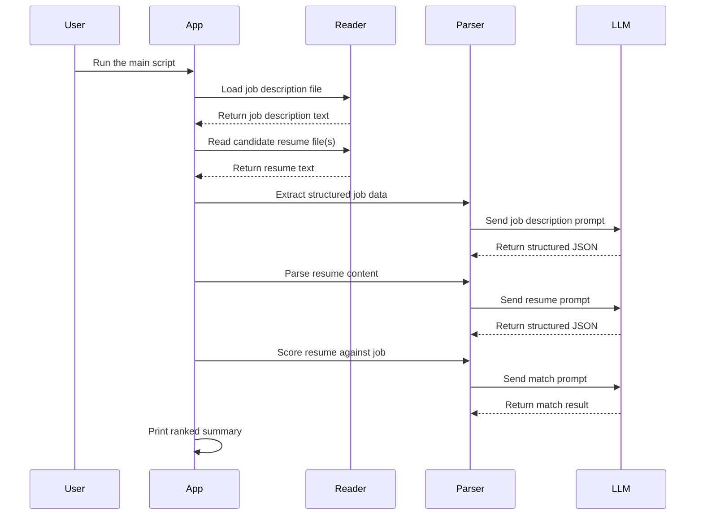

# Workflow Diagram

```mermaid
sequenceDiagram
    participant User
    participant App
    participant Reader
    participant Parser
    participant LLM

    User->>App: Run the main script
    App->>Reader: Load job description file
    Reader-->>App: Return job description text
    App->>Reader: Read candidate resume file(s)
    Reader-->>App: Return resume text
    App->>Parser: Extract structured job data
    Parser->>LLM: Send job description prompt
    LLM-->>Parser: Return structured JSON
    App->>Parser: Parse resume content
    Parser->>LLM: Send resume prompt
    LLM-->>Parser: Return structured JSON
    App->>Parser: Score resume against job
    Parser->>LLM: Send match prompt
    LLM-->>Parser: Return match result
    App->>App: Print ranked summary
```
